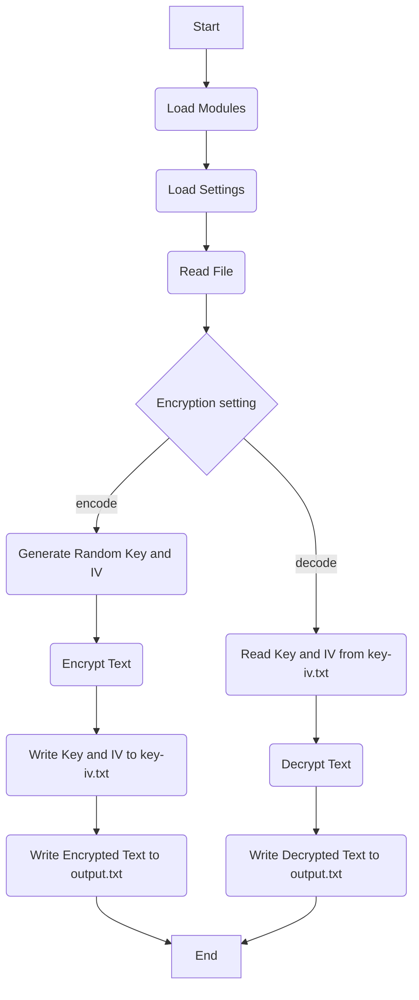

# AES暗号化・復号化ツール

## 概要
このツールは、AES暗号化と復号化を行うNode.jsスクリプトです。設定ファイル`settings.json`に基づいて動作し、指定されたファイルの内容をAESで暗号化または復号化します。

## フローチャート
以下がツールのフローチャートです。

## フォルダ構成
以下がツールの主要なファイルの構成です。

- `main.js`: メインスクリプトファイル。このファイルを実行すると暗号化または復号化が開始されます。
- `settings.json`: 設定ファイル。処理するファイルや暗号化・復号化の設定をここに記述します。
- `key-iv.txt`: 暗号化に使用したkeyとivが保存されるファイル。復号化に使用します。

## 設定ファイルの説明
`settings.json`ファイルは以下の設定を含みます。

- `filePath`: 暗号化または復号化を行いたいファイルのパス。
- `encryption`: 処理の種類。`encode`で暗号化を行い、`decode`で復号化を行います。

## 使用方法
1. `settings.json`を編集し、処理したいファイルのパスと処理の種類（暗号化か復号化か）を設定します。
2. `node main.js`を実行します。このコマンドを実行すると設定に従って暗号化または復号化が開始されます。
3. 暗号化を行った場合、暗号化されたテキストは`output.txt`に保存され、使用したkeyとivは`key-iv.txt`に保存されます。復号化を行った場合、復号化されたテキストは`output.txt`に保存されます。

注意: 暗号化後の復号化を行う場合、`settings.json`で`encryption`を`decode`に変更し、`key-iv.txt`をそのままにしてからスクリプトを再実行してください。
